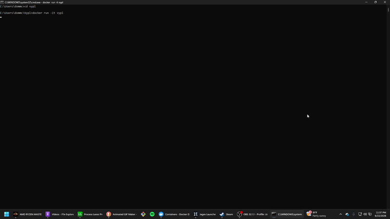

<div align="center">


<p>
  <a href="LICENSE"></a>
  
  
</p>

</div>

---

<div align="center">
  
</div>

---
Ever want at Python REPL with Vim modal editing. Syntax highlighting, autocomplete, macros, registers, text objects the whole shebang? Here ya go.

## Install

```bash
pip install vypl
```

```bash
git clone https://github.com/HoraDomu/Vypl
cd Vypl
pip install -e .
```

## Usage

```bash
vypl
```

## Vim

`ESC` → normal mode. `i` / `a` / `A` / `I` → insert.

| Keybind | Action |
|---|---|
| `h` `j` `k` `l` | Move / history |
| `w` `b` `e` | Word motions |
| `0` `$` | Line start / end |
| `f{char}` / `F{char}` | Find forward / backward |
| `;` / `,` | Repeat / reverse find |
| `r{char}` | Replace char |
| `x` | Delete char |
| `d` `c` `y` + motion | Delete / change / yank |
| `dd` `cc` `yy` | Full line ops |
| `[count]op[count]motion` | `3dd`, `d3w`, `2x`, etc. |
| `p` / `P` | Paste after / before |
| `"a`–`"z` | Named registers |
| `v` | Visual → `d` / `y` / `c` |
| `o` / `O` | New line below / above |
| `gg` / `G` | First / last buffer line |
| `K` | Inspect symbol |
| `.` | Repeat last change |
| `u` | Undo |
| `q{a-z}` / `@{a-z}` | Record / replay macro |
| `/` `n` `N` | Search history |

### Text Objects

| Object | |
|---|---|
| `iw` / `aw` | word |
| `i"` / `a"` | double quotes |
| `i'` / `a'` | single quotes |
| `i(` / `a(` | parens |
| `i[` / `a[` | brackets |
| `i{` / `a{` | braces |

### Ex Commands

`:` in normal mode.

| Command | |
|---|---|
| `:w [file]` | Save session |
| `:r file.py` | Load and run file |
| `:s/old/new/` | Substitute |
| `:s/old/new/g` | Substitute all |
| `:history` | Command history |
| `:clear` | Clear screen |
| `:q` | Quit |

## Platform

Unix terminal required. Linux and macOS run natively. Windows → WSL or Docker.

```bash
git clone https://github.com/HoraDomu/Vypl
cd Vypl
docker build -t vypl .
docker run -it vypl
```

## Contributing

Issues and PRs welcome ->  [github.com/HoraDomu/Vypl](https://github.com/HoraDomu/Vypl/blob/main/CONTRIBUTING.md). GPL v3keep it open.

## Credits

Built on [bpython](https://bpython-interpreter.org/) But I gutted a lot of the code. It was old. Vypl adds essentially the workflow of vim, faster optimzations, more tests, less bloat, a cleaner aesthetic, and Docker support.
